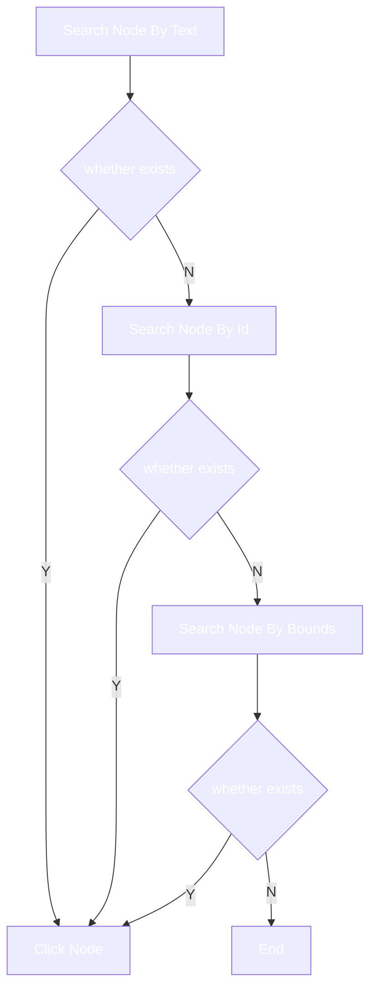

# Contribute

## Implementation Principle

Retrieve the current window object using Android Accessibility Service, traverse the window node, and execute the click action when the node meets the specified conditions.

## Core Logic



## Options Of Configuration File

Position of configuration file：[configuration file](https://github.com/GuoXiCheng/SKIP/blob/main/app/src/main/assets/skip_config.yaml)

### packageName <Badge text="Required" type="danger" vertical="middle" />

Application package name.

You can check the package name by SKIP whitelist.

### skipTexts <Badge text="Optional" type="tip" vertical="middle" />

Match by text, when the node's text **contains** the specified string, execute the click action.You can configure multiple groups.

You can fill in whatever text you see on the phone screen, but it will fail when the actual node text is null.

```yml
- packageName: com.xxx.xxx
  skipTexts:
    - text: 跳过广告
      length: 4
```

### skipIds <Badge text="Optional" type="tip" vertical="middle" />

Match by id, when the node's id **equals** the specified string, execute the click action.You can configure multiple groups.

You need to use the **Android layout analysis tool** to query the id, but it is not available when the actual node id is null.

```yml
- packageName: com.xxx.xxx
  skipIds:
    - id: com.xxx.xxx:id/view_count_down
```

### skipBounds <Badge text="Optional" type="tip" vertical="middle" />

Match by bounds, when the specified bounds **contains** the node's bounds, execute the click action.You can configure multiple groups.

Commonly, interactive nodes have bounds, you need to use the **Android layout analysis tool** to query.

## Android Layout Analysis Tool

what i used is：[web-editor](https://github.com/alibaba/web-editor)，as same as Android Studio or other tools, as long as you can explore the layout structure of the screen node.

### Application Layout Reference

When you select the target node, the layout structure of the node will be displayed, as shown below:


### Config skipTexts and skipIds

`text` corresponds to `test` in the configuration file.

`resourceId` corresponds to `id` in the configuration file.

### Config skipBounds

the value of `skipBounds` needs to be calculated, and the value may look like this:

```yml
- packageName: com.xxx.xxx
  skipBounds:
    - bound: 1223,196,1384,308
      resolution: 1440,3024
```

the 1440,3024 is the maximum width and height of your current phone screen.

the main function of `resolution` is to convert the bounds in the setting to the bounds adapted to the current screen.

the 1223,196,1384,308 respectively represent the left, top, right, bottom of a node in the screen.

refer to the rect information in the above picture: left=x,top=y,right=x+width,bottom=y+height.


