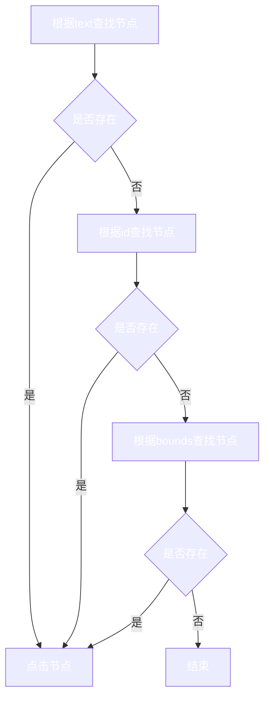

# 贡献指南参考

## 实现原理

利用Android无障碍服务，获取当前窗口对象，遍历窗口节点，当节点符合指定条件时，执行点击的动作。

## 核心逻辑

## 配置文件选项

配置文件位置：[配置文件](https://github.com/GuoXiCheng/SKIP/blob/main/app/src/main/assets/skip_config.yaml)

打开“SKIP”应用后，会自动同步最新配置

### package_name <Badge text="必填" type="danger" vertical="middle" />
应用包名

在手机桌面长按应用图标，打开“应用信息”，点击右上角“应用详情”，可以查看应用包名。

### max_click_count <Badge text="选填" type="tip" vertical="middle" />
最大点击次数

设置为0时，即使查询到指定节点，也不执行点击动作。

### skip_text <Badge text="选填" type="tip" vertical="middle" />
根据文本匹配，当节点的文本**包含**指定字符串时，执行点击动作。

在手机屏幕上看到的文本是什么就可以填什么，但是实际节点text为null时，会失效。

### skip_id <Badge text="选填" type="tip" vertical="middle" />
根据id匹配，当节点的id**包含**指定字符串时，执行点击动作。

id需要使用**Android布局分析工具**查询，但实际节点id为null时，不可用。

### skip_bounds <Badge text="选填" type="tip" vertical="middle" />
根据bounds匹配，当所设定的bounds**包含**节点的bounds是，执行点击动作。

一般可交互的节点都会具有bounds，需要使用**Android布局分析工具**查询，`skip_bounds`可以配置多个。

## Android布局分析工具

我使用的是：[web-editor](https://github.com/alibaba/web-editor)，使用Android Studio自带的或其他工具也一样，只要可以探查屏幕节点的布局结构即可。