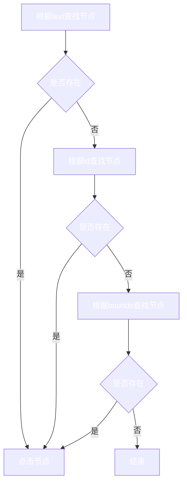

# 贡献指南参考

## 实现原理

利用Android无障碍服务，获取当前窗口对象，遍历窗口节点，当节点符合指定条件时，执行点击的动作。

## 核心逻辑



## 配置文件选项

配置文件位置：[配置文件](https://github.com/GuoXiCheng/SKIP/blob/main/app/src/main/assets/skip_config_v2.yaml)

### packageName <Badge text="必填" type="danger" vertical="middle" />
应用包名

在SKIP的应用白名单中，可以查看应用的包名。

### skipTexts <Badge text="选填" type="tip" vertical="middle" />

根据文本匹配，当节点的文本**包含**指定字符串时，执行点击动作。可以配置多组。

在手机屏幕上看到的文本是什么就可以填什么，但是实际节点text为null时，会失效。

```yml
- packageName: com.xxx.xxx
  skipTexts:
    - text: 跳过广告
      length: 4
```

### skipIds <Badge text="选填" type="tip" vertical="middle" />

根据id匹配，当节点的id**等于**指定字符串时，执行点击动作。可以配置多组。

id需要使用**Android布局分析工具**查询，但实际节点id为null时，不可用。

```yml
- packageName: com.xxx.xxx
  skipIds:
    - id: com.xxx.xxx:id/view_count_down
```

### skipBounds <Badge text="选填" type="tip" vertical="middle" />

根据bounds匹配，当所设定的bounds**包含**节点的bounds时，执行点击动作。可以配置多组。

一般可交互的节点都会具有bounds，需要使用**Android布局分析工具**查询。

## Android布局分析工具

我使用的是：[web-editor](https://github.com/alibaba/web-editor)，使用Android Studio自带的或其他工具也一样，只要可以探查屏幕节点的布局结构即可。

### 应用布局参考图

当你选中想要的目标节点时，会显示该节点的布局结构，参考如下：


### 配置skipTexts和skipIds

`text`呈现的值，可以对应到配置文件中的`text`

`resourceId`呈现的值，可以对应到配置文件中的`id`

### 配置skipBounds

skipBounds的值是需要计算得到的，可能长得像这样

```yml
- packageName: com.xxx.xxx
  skipBounds:
    - bound: 1223,196,1384,308
      resolution: 1440,3024
```

其中的1440,3024是你当前手机屏幕的最大宽高。

其中的1223,196,1384,308分别表示一个节点在屏幕中的: left,top,right,bottom

参考上图中rect的信息: left=x,top=y,right=x+width,bottom=y+height


